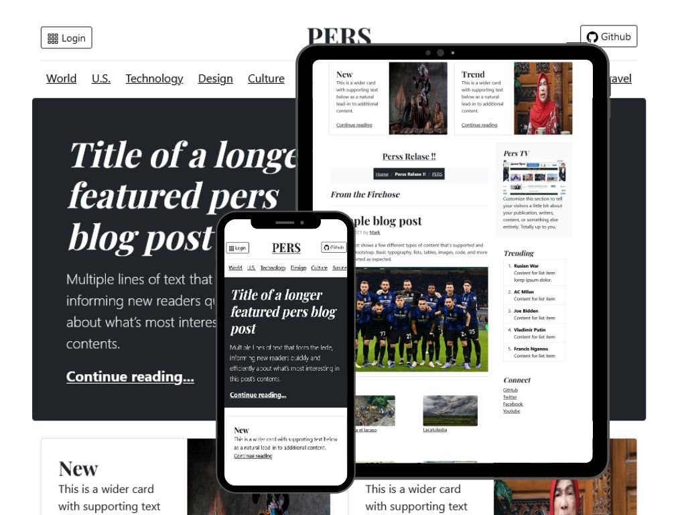
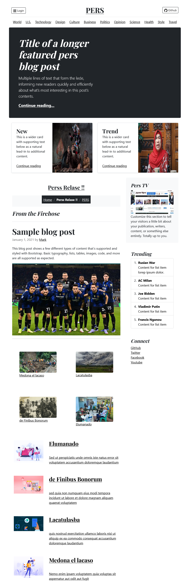

# New Magazine website themes template - Modern CMS Build a website without database.
---
A new generation get simpe cms axcora tech for develope website project powerfull !!

No need a database for installation , make your website very fast and SEO friendly.

News magazine themes template website apps. Modern design with boostrap 5
--

------
Full display 

-------------------------------------

BACKEND ADMIN CMS

Login Area for backend

Page and article post menu.

Create article post very simple and easy

File manager system

Back end setting

 -----------------------------------------------------------------
### how to install

[read documentation →](https://axcora.com/getaxcoracms/index.php?id=get-started)

---

Backend
+ Page for create new post article content you can edit and delete too.
+ File menu for upload media manager.
+ Setting for change password and others.
+ Template for change and update themes display.
+ SEO : automaticly generate meta title , description , facebook, twitter.

----

No need a database installation make your website very fast, and of course with SEO friendly include, simple and easy to use.

----

Need demo ?? 

[Play Demo →](https://youtu.be/p2y_N8rUEB0)

More themes :
https://axcora.com/getaxcoracms

present by https://axcora.com

Hapy codding !!
